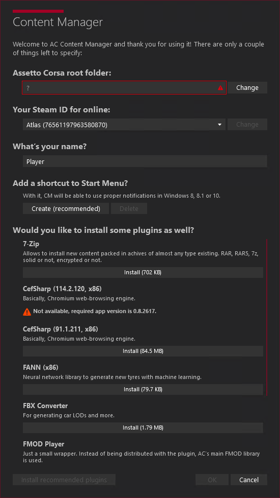
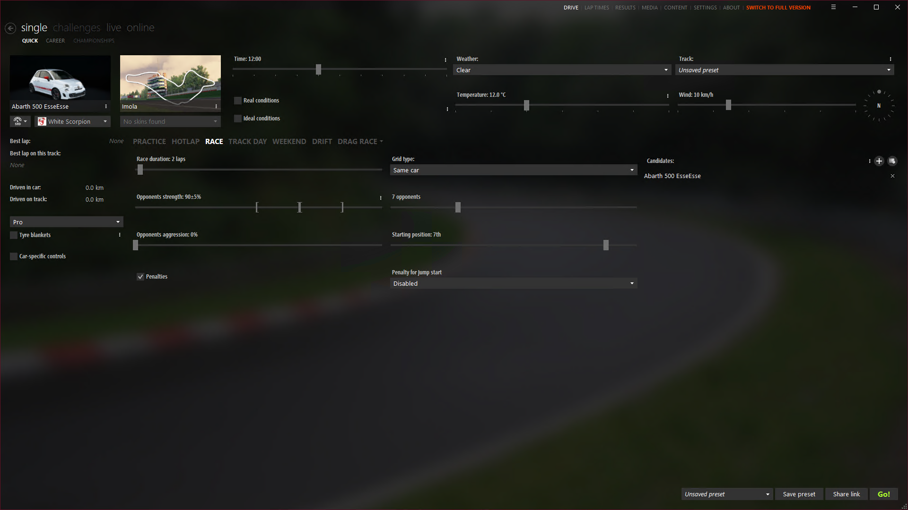
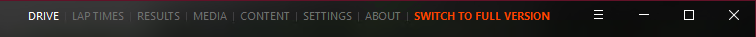
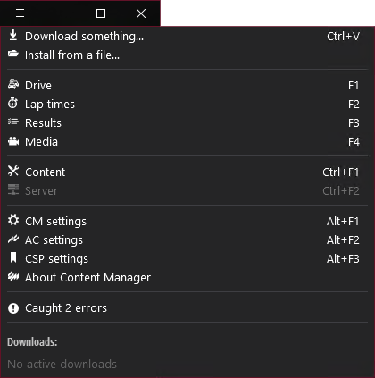
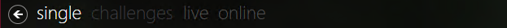
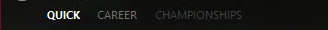

# Content Manager

Let's go ahead and set up Content Manager so we can get straight into the game!

## Installation

If you're caught up, you should have Assetto Corsa and Content Manager installed already.

Go ahead and launch Content Manager.

## Initial Setup

When you open Content Manager for the first time, you'll get met with this screen.



Let's fill out these fields.

### Assetto Corsa root folder

Sometimes it will find it by itself and you won't have to do anything. If that's not the case, please press the `Change` button and find the `assettocorsa` folder, often found in `C:\Program Files (x86)\Steam\steamapps\common` on Windows.

### Your Steam ID for online

This should be the Steam account that has Assetto Corsa in their library.

### What's your name?

:::tip
This can always be changed later
:::
This is the online name, that other players will see. Since Assetto Corsa doesn't use your Steam details, this needs to be set manually.

### Add a shortcut to Start Menu?

It is recommended to press the Create button, so that you can open Content Manager, just by searching on your PC.

### Would you like to install some plugins as well?

As a rule of thumb, you wanna install all of the plugins.

## Basic Layout

When you press the `OK` button, you'll be met with the main Content Manager window for the first time.  
It looks like this:

Let's break it down, top to bottom.  
First up, we have the title bar. In this bar, we have a menu. This is the absolute top menu, that controls what you see below it.
  
Let's go left to right:

- **DRIVE**: This is the default tab. This is where you manage everything related to opening the game and playing.
- **LAP TIMES**: This is the tab where you see lap data from your laps in-game.
- **RESULTS**: This is the tab where you get different types data from your races as well as overall data from your sessions.
- **MEDIA**: This is the tab where you can manage all your screenshots and replays.
- **CONTENT**: This is the tab where you manage all your content, such as cars, tracks, apps, miscelaneous mods and so on. You can also install new content from here, by using the built-in browser.
  :::info
  You can only install mods from the in-app browser if you have the full version of Content Manager.
  :::
- **SETTINGS**: This is the tab where you manage all your settings, such as graphics, controls, general settings and so on.
- **ABOUT**: This is the tab where you can see information about Content Manager, such as version, release notes, credits and so on.
- **Switch to Full Version**: You only see this button if you're using the free version of Content Manager. This button opens a dialog for you to put in your license key, if you have one.

As well as these tabs, you have a hamburger menu, which is the three lines on the top right. You can find the following options in this menu:  


Below the title bar, we have the first menu bar. This changes depending on what title bar menu tab you're on.  


And below the first menu bar, we also have a second menu bar. This changes depending on what first menu bar tab you're on.  


Below this, we have the main window. This is where you'll see the main content of the tab you're on.

We will be referencing locations in Content Manager by using the following format:

```
Top Menu > First Menu > Second Menu
```

For example, `DRIVE > Quick > Go` would mean you press the `DRIVE` tab, then the `Quick` button, then the `Go` button.

**Let's get Custom Shaders Patch (CSP) installed, so we can get the game looking as good as possible.**
