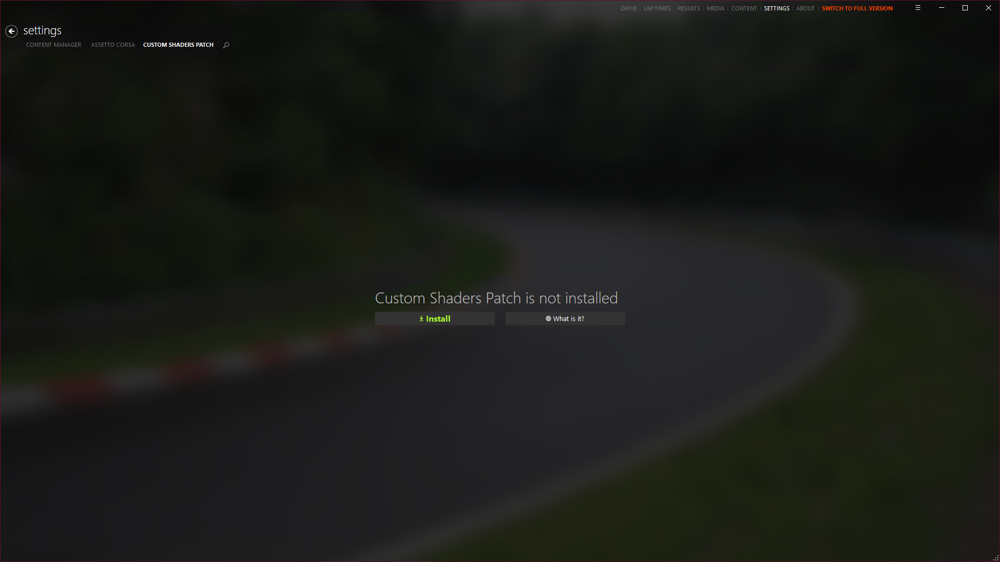

import Tabs from '@theme/Tabs';
import TabItem from '@theme/TabItem';

# Custom Shaders Patch

## What is Custom Shaders Patch?

Custom Shaders Patch (CSP) is a mod for Assetto Corsa that adds a number of graphical and gameplay enhancements to the game. It is developed by Ilja Jusupov aka x4fab and is a must-have for any sim-racer who wants to get the most out of Assetto Corsa.

## Installation

The free version of CSP can be downloaded from inside Content Manager. Simply open Content Manager, go to `Settings > Custom Shaders Patch` and click on the `Install` button.  

### Paid Preview Version

There is also a paid preview version of CSP that can be purchased from the [CSP Patreon page](https://www.patreon.com/x4fab). The preview version includes rain and is updated more frequently.  
This version can be installed by downloading the zip file from the Patreon page and extracting it to the Assetto Corsa installation folder, or by using the Quick install link on the latest release post.
:::info
If you have the full version of Content Manager, you can install mods by simply dragging and dropping the zip file into the Content Manager window, and opening the hamburger menu in the top right corner and selecting `Install`.
:::

## Enabling Rain

To have rain, you first need to install the paid preview version of CSP.  
You also need to have either **SOL** or **Pure**. Two popular weather mods for Assetto Corsa, that work with CSP to provide realistic weather and lighting effects.

:::warning
They do not work interchangeably, so you will need to choose one or the other.
:::

<Tabs
defaultValue="sol"
values={[
{ label: "SOL", value: "sol" },
{ label: "Pure", value: "pure" }
]}

>

    <TabItem value="sol">
        SOL is a free mod by Peter Boese that can be downloaded from [RaceDepartment](https://www.racedepartment.com/downloads/sol.24914/). It is no longer being updated, but is still a popular free choice for many sim-racers.
    </TabItem>
    <TabItem value="pure">
        Pure is a paid mod by Peter Boese that can be purchased from [Peter's Patreon](https://www.patreon.com/peterboese). It is the successor to SOL and is updated more frequently. It is also more stable, has better performance and looks better than SOL.
    </TabItem>

</Tabs>

Both SOL and Pure have their own installation instructions, so be sure to follow them carefully.

When you have installed either SOL or Pure, you can enable rain in Content Manager by going to `Settings > Custom Shaders Patch > WeatherFX` and setting `Weather script` & `Controller script` to SOL or Pure.  
This loads the rain and weather effects from the chosen mod. But to actually see it ingame, we have to set the weather when launching a singleplayer session, or join a server that has rain enabled and is currently using a rain weather preset.
When you pick a rain preset on the `Drive` tab, Content Manager will give you a hint to enable `Extended Physics`. This is a setting that improves the physics of the game when driving in the rain, and is recommended to be enabled.

Both SOL and Pure have an in-game weather app that can be used to set the weather, time and date, and other weather-related settings. These apps can be found on the right side of the screen in the apps section, in game.
