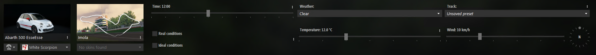
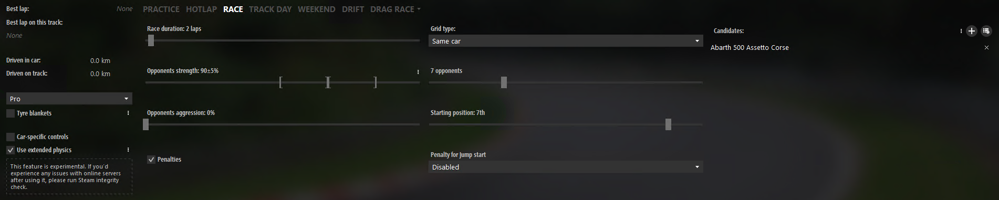
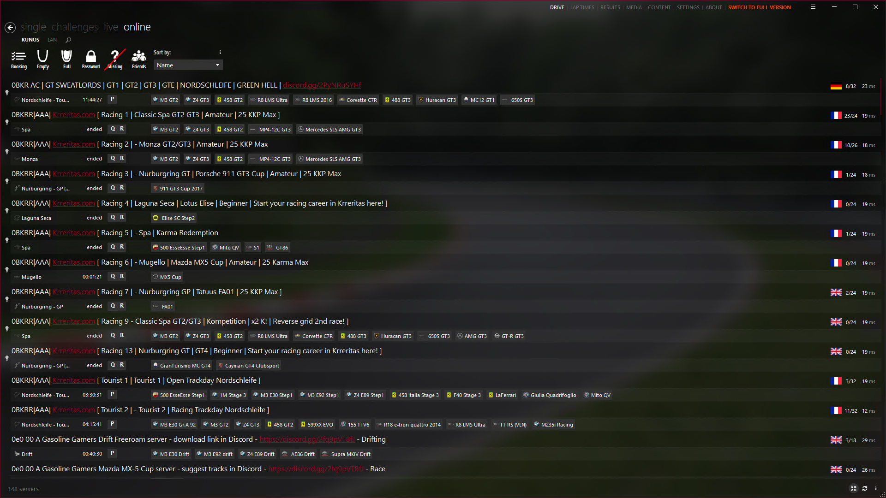
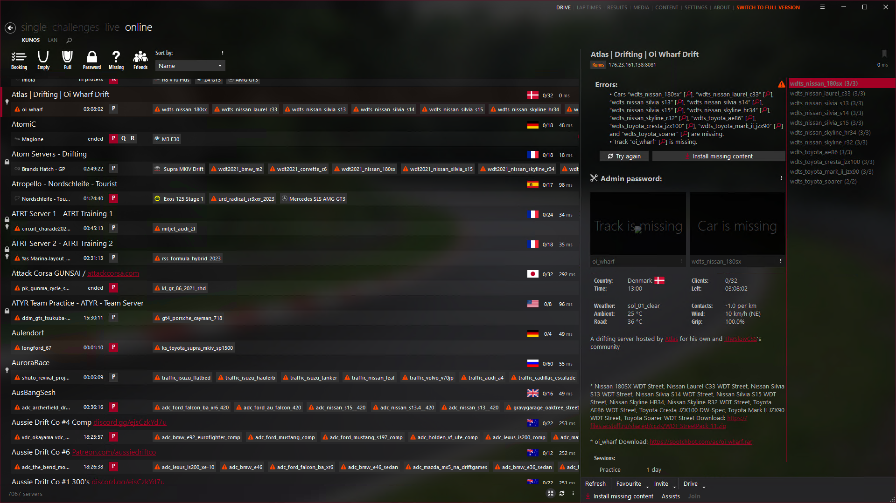

# First Drive

Now that we're somewhat set up and ready to go, let's go for a drive.

## Singleplayer

If you want to start playing singleplayer, you can open Content Manager and go to `DRIVE > single > QUICK`.  
Here, you will see this screen:  
  
Let's go through it.  
First, we have this section:  
  
On the left, we have the car selection. Press on it and be met with a window where you can select the car you want to drive. This selection window has an extensive search and filter system, so you can easily find the car you want.

To the right of that, we have the track selection. Press on it and be met with a window to select the track you want to drive on. This selection window also has an extensive search and filter system, so you can easily find the track you want.

We have time and weather settings to the right of the car and track selection. You can set the time of day, the date, and the weather. Remember the three vertical dots on settings in Content Manager, as they usually contain more settings.

On the far right of the window, we have track road settings, where you can set the road grip.

Let's move down a level after you've set these things according to your liking.  
  
On the far left, we have some stats, but we also have some essential settings.  
The drop-down that says Pro is our assists preset. To change the individual assists, press the three vertical dots on the right of the drop-down.

`Tyre blankets` are for when you want to start with warm tires. This is usually used in racing, but you can use it.

`Use extended physics` is a setting from CSP that you should always have on. It makes the physics more realistic, especially during rain.

Let's move to the right.  
Here, you'll see the game mode and game mode settings. By default, it will be on Race. You can change the game mode by pressing on it. Freeroam is usually done in Practice mode.  
The settings are self-explanatory, but if you want to know more about them, you can hover over them, and a tooltip will appear.

When you have set everything according to your liking, press `Go!` at the bottom right of the window.

## Multiplayer

If you want to play multiplayer, you can open Content Manager and go to `DRIVE > online > KUNOS`.  
Here, you will see this screen:  

You will see a list of servers. You can filter the servers by various settings at the top of the window.  
When you have found a server you'd like to join, please press on it. You will be met with a window to see the server details, car list, and current track.

It looks like this:  
  
As you can see. We have a lot of missing content here. This is because the server has mods that we still need to install.

Luckily, this server has provided direct download links for the mods. So, we get a `Install missing content` button. When we press it, the hamburger menu in the top right will light up, and you can see the download progress.

When the download for each mod is done, press `Install` on them, and they will be installed.

When all mods are installed, you can see the track with a proper name, image, and car list. You have to select a car that is available on the server.  
The available cars have bright text, while the unavailable cars have grey text.  
When you have selected a car, set up the assists at the bottom of the window and press `Join`.
:::note
Some servers have forced assists, so you can't change some.
:::
