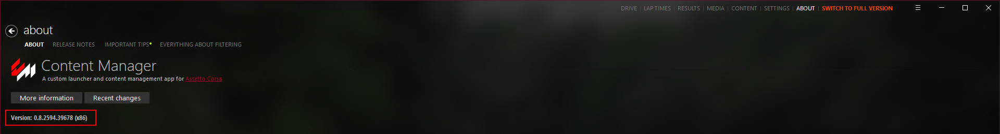
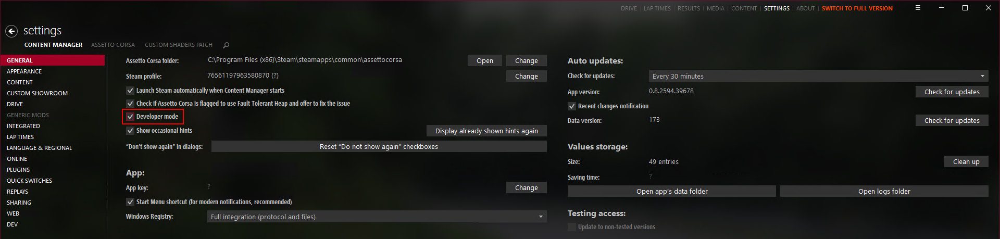

# Developer Mode

It is recommended to enable developer mode to access the full functionality of Content Manager, CSP and Assetto Corsa. It enables a lot of useful features and tools.

## Enabling Developer Mode

To enable developer mode, open `About > About`, then go to the version number and click on it 5 times and press `Yes` on the dialog that appears.  

## Disabling Developer Mode

To disable developer mode, go to `Settings > Content Manager > General` and uncheck `Developer mode`.

